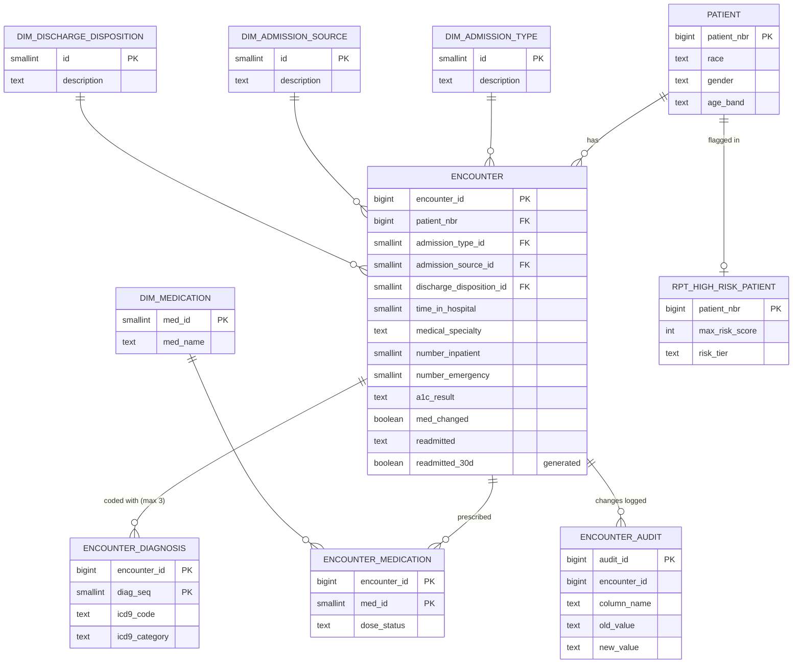

# Entity-Relationship Diagram

GitHub renders this Mermaid diagram automatically.

```mermaid
erDiagram
    PATIENT ||--o{ ENCOUNTER : has
    ENCOUNTER ||--o{ ENCOUNTER_DIAGNOSIS : "coded with (max 3)"
    ENCOUNTER ||--o{ ENCOUNTER_MEDICATION : prescribed
    DIM_MEDICATION ||--o{ ENCOUNTER_MEDICATION : ""
    DIM_ADMISSION_TYPE ||--o{ ENCOUNTER : ""
    DIM_ADMISSION_SOURCE ||--o{ ENCOUNTER : ""
    DIM_DISCHARGE_DISPOSITION ||--o{ ENCOUNTER : ""
    PATIENT ||--o| RPT_HIGH_RISK_PATIENT : "flagged in"
    ENCOUNTER ||--o{ ENCOUNTER_AUDIT : "changes logged"

    PATIENT {
        bigint patient_nbr PK
        text race
        text gender
        text age_band
    }
    ENCOUNTER {
        bigint encounter_id PK
        bigint patient_nbr FK
        smallint admission_type_id FK
        smallint admission_source_id FK
        smallint discharge_disposition_id FK
        smallint time_in_hospital
        text medical_specialty
        smallint number_inpatient
        smallint number_emergency
        text a1c_result
        boolean med_changed
        text readmitted
        boolean readmitted_30d "generated"
    }
    ENCOUNTER_DIAGNOSIS {
        bigint encounter_id PK
        smallint diag_seq PK
        text icd9_code
        text icd9_category
    }
    ENCOUNTER_MEDICATION {
        bigint encounter_id PK
        smallint med_id PK
        text dose_status
    }
    DIM_MEDICATION {
        smallint med_id PK
        text med_name
    }
    DIM_ADMISSION_TYPE {
        smallint id PK
        text description
    }
    DIM_ADMISSION_SOURCE {
        smallint id PK
        text description
    }
    DIM_DISCHARGE_DISPOSITION {
        smallint id PK
        text description
    }
    RPT_HIGH_RISK_PATIENT {
        bigint patient_nbr PK
        int max_risk_score
        text risk_tier
    }
    ENCOUNTER_AUDIT {
        bigint audit_id PK
        bigint encounter_id
        text column_name
        text old_value
        text new_value
    }
```
